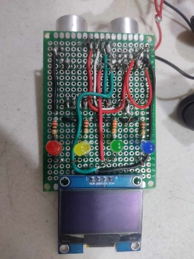

# nano-ultrasonic-sh1106-oled-rangefinder

An Arduino Nano-based rangefinder using an ultrasonic sensor and SH1106 OLED display, with visual feedback via LEDs and a laser pointer for accuracy.

## Components Used
- Arduino Nano
- Ultrasonic Distance Sensor (HC-SR04)
- SH1106 OLED Display (128x64, I2C, address: 0x3C)
- 9V Battery + Battery Clip
- SPST Rocker Switches ×2
- 220Ω Resistors ×4
- Yellow, Blue, Green, Red LEDs
- Laser Module (KY-008)
- Double sided and one sided PCBs
- Wires

## Project Description

This project measures distance using an ultrasonic sensor and displays the output in millimeters, centimeters, inches, and meters on an SH1106 OLED. LEDs light up in patterns based on distance ranges, and a laser module helps with alignment. The circuit is powered by a 9V battery with switches for modular control.

## Circuit Overview

### Ultrasonic Sensor Wiring

VCC → 5V

GND → GND

Trig → D2

Echo → D4

### OLED Display (SH1106) Wiring

VDD → 5V

GND → GND

SDA → A4

SCL → A5

### LEDs via 220Ω Resistors Wiring

D8 → LED 4

D9 → LED 3

D10 → LED 2

D11 → LED 1

### Laser Module 
powered via the power management board

## Actual Circuit Images

### Circuit Diagram

### Operational Circuit

### Main Board - Top View

### Main Board - Bottom View

### Power Management Board

## Setup Instructions

1. Connect all components as per the circuit diagram.

2. Upload the provided Arduino code using the Arduino IDE.

3. Install the required libraries:
   - Adafruit GFX
   - Adafruit SH110X

4. Once powered on, the OLED shows measured distance in real time.

    LEDs light up based on distance intervals:
     - 0–100 cm: LED 1
     - 101–200 cm: LEDs 1–2
     - 201–300 cm: LEDs 1–3
     - 301–400 cm: LEDs 1–4

## Notes

The laser module improves measurement accuracy by providing a visual reference.

The project uses a two-board system: a main board (sensing + display) and a power management board (battery + switches + laser).

The circuit diagram was created using the web platform [wokwi.com](https://wokwi.com/).
